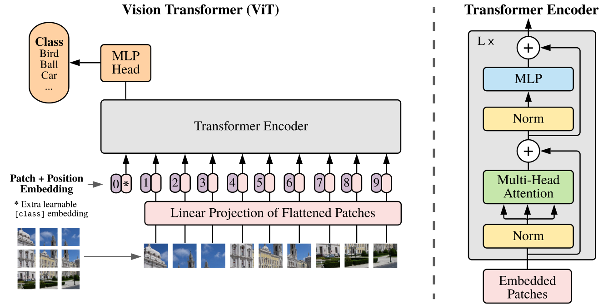
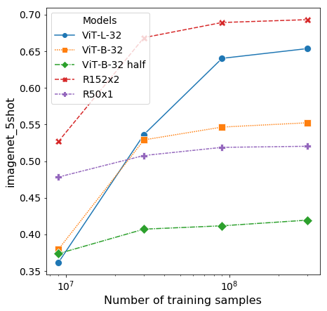
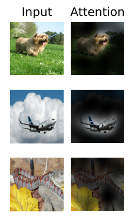
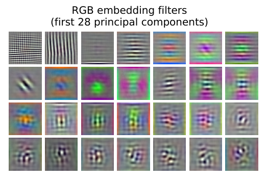
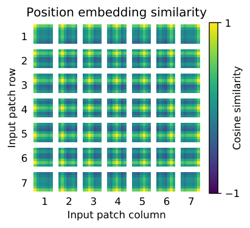

# ViT 逐段流畅中文转写

> 转写规范：严格按原文顺序；术语用「中文（English term）」；每段附一句话要点。
> 图表处理：已获取到原图的图下载到 `images/` 并在对应位置以 markdown 图片语法嵌入；arXiv HTML 版未提供图片资源的图（如 Figure 2、5）与数据表（Table 1、2），保留文字说明。

---

## 摘要（Abstract）

**【转写】** 虽然 Transformer 架构（Transformer architecture）已成为自然语言处理（NLP）任务的事实标准，但它在计算机视觉中的应用仍很有限。在视觉中，注意力机制（attention）要么与卷积网络（convolutional networks, CNN）结合使用，要么用来替换卷积网络的某些组件、同时保留其整体结构。我们表明：这种对 CNN 的依赖并非必要——直接作用在图像块（image patches）序列上的纯 Transformer（pure transformer），在图像分类任务上也能表现得非常好。当在大规模数据上预训练（pre-trained）并迁移（transferred）到多个中等或小型图像识别基准（ImageNet、CIFAR-100、VTAB 等）时，视觉 Transformer（Vision Transformer, ViT）相较当时最先进的卷积网络取得出色结果，且所需预训练算力显著更少。
**【要点】** 纯 Transformer + 图像块序列即可在视觉分类上匹敌 SOTA CNN，且更省算力。

---

## §1 引言（Introduction）

**§1-¶1【转写】** 基于自注意力（self-attention）的架构，尤其是 Transformer（Vaswani et al. 2017），已成为自然语言处理的首选模型。主流做法是在大型文本语料上预训练，再在小规模任务数据上微调（fine-tune）（Devlin et al. 2019）。得益于 Transformer 的计算效率与可扩展性（scalability），训练超过千亿参数的模型已成为可能（Brown et al. 2020; Lepikhin et al. 2020），且随模型与数据增长，性能仍未现饱和迹象。
**【要点】** NLP 用 Transformer 大规模预训练+微调已成范式，且未见饱和。

**§1-¶2【转写】** 然而在计算机视觉中，卷积架构仍占主导（LeCun 1989; Krizhevsky 2012; He 2016）。受 NLP 成功启发，多项工作尝试将 CNN 类架构与自注意力结合（Wang 2018; Carion 2020），也有工作完全用注意力替换卷积（Ramachandran 2019; Wang 2020a）。后者虽在理论上高效，但因采用特殊注意力模式，未能在现代硬件加速器上有效扩展；故在大规模图像识别中，经典 ResNet 类架构仍是 SOTA。
**【要点】** 视觉仍由 ResNet 主导；纯注意力模型因硬件不友好而难以扩展。

**§1-¶3【转写】** 受 Transformer 在 NLP 中扩展成功的启发，我们尝试以尽可能少的改动，把标准 Transformer 直接用于图像。做法是：把图像切成 patch，把这些 patch 的线性嵌入（linear embeddings）序列作为 Transformer 的输入；图像 patch 被当作与 NLP 中 token（词）一样对待。模型以监督方式（supervised fashion）在图像分类上训练。
**【要点】** 核心方法：切 patch → 线性嵌入序列 → 标准 Transformer，监督训练。

**§1-¶4【转写】** 当在 ImageNet 等中等规模数据集上训练（无强正则化）时，这些模型的准确率比同尺寸 ResNet 低几个百分点。这个看似令人沮丧的结果其实可预期：Transformer 缺乏 CNN 固有的归纳偏置（inductive biases），如平移等变性（translation equivariance）与局部性（locality），在数据不足时泛化不佳。
**【要点】** 小数据上 ViT 不如 ResNet——因缺少 CNN 归纳偏置。

**§1-¶5【转写】** 但若在更大（14M–300M 图像）数据集上训练，情况就变了：大规模训练胜过归纳偏置（large scale training trumps inductive bias）。ViT 在充分规模预训练后迁移到小数据任务上结果出色。在公开 ImageNet-21k 或自建 JFT-300M 上预训练后，ViT 在多个识别基准上达到或超越 SOTA：最佳模型在 ImageNet 达 88.55%、ImageNet-ReaL 90.72%、CIFAR-100 94.55%、VTAB（19 任务）77.63%。
**【要点】** 全文核心论断——大规模训练胜过归纳偏置；据此 ViT 在大数据预训练后全面追平/超越 SOTA。

---

## §2 相关工作（Related Work）

**§2-¶1【转写】** Transformer 由 Vaswani et al. 2017 为机器翻译提出，此后成为众多 NLP 任务的 SOTA。大型 Transformer 通常先在大语料预训练再微调：BERT（Devlin 2019）用去噪自监督预训练，GPT 系列用语言建模预训练（Radford 2018/2019; Brown 2020）。
**【要点】** Transformer 起源与 NLP 预训练范式（BERT 去噪 / GPT 语言建模）。

**§2-¶2【转写】** 把自注意力直接用于图像，要求每个像素关注所有其他像素；因像素数二次方代价，无法扩展到真实输入尺寸。为此过去有多种近似：Parmar 2018 仅在每个查询像素的局部邻域做自注意力；这类局部多头点积自注意力块可完全替代卷积（Hu 2019; Ramachandran 2019; Zhao 2020）。另一路线是稀疏 Transformer（Sparse Transformers, Child 2019）用可扩展近似实现全局自注意力；也有按可变大小块（Weissenborn 2019）或仅在单轴（Ho 2019; Wang 2020a）施加注意力。这些特殊注意力架构在视觉任务上有 promising 结果，但需复杂工程才能在硬件加速器上高效实现。
**【要点】** 像素级全局注意力代价二次方不可扩展；已有局部/稀疏/分轴近似，但硬件不友好。

**§2-¶3【转写】** 与我们最相关的是 Cordonnier et al. 2020，它从输入图提取 2×2 patch 并在其上做全自注意力，与 ViT 很像；但我们的工作更进一步——证明大规模预训练使 vanilla Transformer 与（甚至优于）SOTA CNN 竞争。此外 Cordonnier 用 2×2 小 patch，只适用小分辨率图像，而我们也能处理中等分辨率图像。
**【要点】** Cordonnier 2020 最接近 ViT，但未论证大规模预训练竞争力且仅限小图。

**§2-¶4【转写】** 把 CNN 与自注意力结合也备受关注：如为图像分类增强特征图（Bello 2019），或用自注意力后处理 CNN 输出用于检测（Hu 2018; Carion 2020）、视频（Wang 2018; Sun 2019）、分类（Wu 2020）、无监督目标发现（Locatello 2020）、文本-视觉统一任务（Chen 2020c; Lu 2019; Li 2019）。
**【要点】** CNN + 注意力的混合工作遍布多个视觉子任务。

**§2-¶5【转写】** 另一相关工作是 image GPT（iGPT, Chen 2020a）：先把图像降分辨率与降色，再用 Transformer 处理像素；以无监督生成式模型训练，所得表征可微调或线性探测用于分类，在 ImageNet 上最高达 72%。
**【要点】** iGPT 走像素级生成式自监督路线，ImageNet 72%。

**§2-¶6【转写】** 我们的工作也加入"在比标准 ImageNet 更大规模上做图像识别"的研究集合：用额外数据源可在标准基准取得 SOTA（Mahajan 2018; Touvron 2019; Xie 2020）。Sun 2017 研究了 CNN 性能随数据集大小的缩放规律；Kolesnikov 2020 与 Djolonga 2020 实证探索了从 ImageNet-21k、JFT-300M 的 CNN 迁移学习。我们也聚焦这两个数据集，但训练的是 Transformer 而非此前工作的 ResNet。
**【要点】** 大数据迁移学习路线已成熟，ViT 把骨干从 ResNet 换成 Transformer。

---

## §3 方法（Method）

> 图 1 模型总览：图像切成固定大小 patch → 线性嵌入 → 加位置嵌入 → 送入标准 Transformer 编码器；分类用一个可学习的 "class token"。

**§3 引言段【转写】** 在模型设计上我们尽量贴近原版 Transformer（Vaswani 2017）。这种有意保持简单的设置有个好处：可扩展的 NLP Transformer 架构及其高效实现几乎可以开箱即用。
**【要点】** 设计原则：尽量少改，复用 NLP 成熟实现。

### §3.1 视觉 Transformer（Vision Transformer, ViT）

**§3.1-¶1【转写】** 标准 Transformer 接收 1D 的 token 嵌入序列。为处理 2D 图像，我们把图像 x∈ℝ^{H×W×C} 重排为展平的 2D patch 序列 x_p∈ℝ^{N×(P²·C)}，其中 (H,W) 为原图分辨率、C 为通道数、(P,P) 为每个 patch 分辨率、N=HW/P² 为 patch 数（也即 Transformer 有效输入序列长度）。Transformer 各层用恒定潜在维度 D，故把 patch 展平后用可训练线性投影映射到 D 维（式 1），其输出称为 patch 嵌入（patch embeddings）。
**【要点】** 图像重排为 N=HW/P² 个 patch，线性投影到 D 维得 patch 嵌入。

**§3.1-¶2【转写】** 类似 BERT 的 `[class]` token，我们在嵌入 patch 序列前加一个可学习嵌入（z_0^0=x_class），其在编码器输出端的状态（z_L^0）作为图像表示 y（式 4）。预训练与微调时都在 z_L^0 上接分类头：预训练时用单隐藏层 MLP，微调时用单线性层。
**【要点】** 借鉴 BERT [class] token 做分类表示；分类头预训练用 MLP、微调用线性层。

**§3.1-¶3【转写】** 位置嵌入（position embeddings）加到 patch 嵌入上以保留位置信息。我们用标准可学习 1D 位置嵌入，因为更高级的 2D 感知位置嵌入未见显著提升（附录 D.4）。所得嵌入向量序列作为编码器输入。
**【要点】** 用可学习 1D 位置嵌入即可，2D 感知版本无显著增益。

**§3.1-¶4【转写】** Transformer 编码器由多头自注意力（multihead self-attention, MSA）与 MLP 块交替层组成（式 2、3）。每个块前施 LayerNorm（LN），每块后接残差连接；MLP 含两层带 GELU 非线性。式 1 给出序列初始化（[class] + patch 投影 + 位置嵌入），式 4 给出分类输出 y=LN(z_L^0)。
**【要点】** 编码器 = MSA/MLP 交替 + Pre-LN + 残差；MLP 用 GELU。

**Inductive bias（归纳偏置）段【转写】** 注意 ViT 的图像专用归纳偏置远少于 CNN：CNN 每层都内建局部性、二维邻域结构与平移等变性；ViT 中只有 MLP 层是局部且平移等变的，自注意力层是全局的。二维邻域结构用得很克制——仅在模型开端切 patch、以及微调时为不同分辨率调整位置嵌入时使用。除此之外，位置嵌入在初始化时不携带 patch 的 2D 位置信息，patch 间的所有空间关系都要从头学。
**【要点】** ViT 几乎无 CNN 归纳偏置，空间关系全靠数据学——这是小数据欠佳、大数据优势的根源。

**Hybrid Architecture（混合架构）段【转写】** 作为原始 patch 的替代，输入序列也可由 CNN 特征图构成。此时 patch 嵌入投影 E 作用于从 CNN 特征图提取的 patch；特例是 patch 空间大小为 1×1，即把特征图空间维展平后投影到 Transformer 维度。分类嵌入与位置嵌入照常加入。
**【要点】** 提供 CNN+ViT 混合变体：以 CNN 特征图作为 patch 输入。

### §3.2 微调与更高分辨率（Fine-tuning and Higher Resolution）

**§3.2【转写】** 通常在大数据集预训练 ViT，再微调到下游任务：移除预训练预测头，接一个零初始化的 D×K 前馈层（K 为下游类别数）。在比预训练更高分辨率下微调往往有益；此时保持 patch 大小不变会得到更长的有效序列。ViT 可处理任意序列长度（受内存限制），但预训练位置嵌入不再适用，故按其原图位置对预训练位置嵌入做 2D 插值（2D interpolation）。注意，这种分辨率调整与 patch 提取是手动注入 2D 结构归纳偏置的仅有两处。
**【要点】** 微调：换分类头 + 高分辨率 + 位置嵌入 2D 插值；这是 ViT 仅有的两处手动 2D 归纳偏置。

---

## §4 实验（Experiments）

**§4 引言【转写】** 我们评估 ResNet、ViT 与混合模型的表达学习能力。为理解各模型的数据需求，在规模递增的数据集上预训练并评估多个基准。在预训练算力考量下 ViT 表现优异——以更低预训练成本在多数识别基准达 SOTA。最后还做了自监督小实验，显示自监督 ViT 有前景。
**【要点】** 评估三族模型 + 不同预训练规模，关注算力-性能权衡，并初探自监督。

### §4.1 设置（Setup）

**数据集段【转写】** 探索可扩展性用：ImageNet（1k 类/1.3M 图）、其超集 ImageNet-21k（21k 类/14M 图）、JFT（18k 类/303M 高分辨率图，Sun 2017）。按 Kolesnikov 2020 对下游测试集去重。迁移到 ImageNet（原验证标签与清洗 ReaL 标签 Beyer 2020）、CIFAR-10/100、Oxford-IIIT Pets、Oxford Flowers-102；并评估 19 任务 VTAB 套件（Zhai 2019b，每任务 1000 训练样本，分 Natural/Specialized/Structured 三组）。
**【要点】** 三档预训练数据（1.3M/14M/303M）；下游含 ImageNet/CIFAR/Pets/Flowers/VTAB。

**模型变体段【转写】** ViT 配置基于 BERT（表 1）：Base、Large 直接取自 BERT，新增更大的 Huge。记法 ViT-L/16 = Large + 16×16 patch。注意序列长度与 patch 大小平方成反比，patch 越小越贵。CNN 基线用 ResNet 但把 BatchNorm 换成 GroupNorm 并用标准化卷积（Qiao 2019），记为 ResNet (BiT)。混合模型把 CNN 中间特征图以 1"像素"patch 喂入 ViT；通过保留或删去 ResNet stage 4 来改变序列长度（删去则序列长 4×）。
📊 原文此处有表（Table 1 模型配置），约显示：ViT-Base 12层/768维/86M 参；ViT-Large 24层/1024维/307M；ViT-Huge 32层/1280维/632M。
**【要点】** Base/Large/Huge 三档；CNN 基线为 BiT；混合模型可调序列长度。

**训练与微调段【转写】** 所有模型（含 ResNet）用 Adam（β1=0.9, β2=0.999）、batch 4096、高权重衰减 0.1（对迁移有益；附录 D.1 表明此设置下 Adam 对 ResNet 略优于 SGD）；线性学习率 warmup + decay。微调用带动量 SGD、batch 512。ImageNet 结果在更高分辨率微调（ViT-L/16 用 512、ViT-H/14 用 518）并配合 Polyak 平均（因子 0.9999）。
**【要点】** 预训练 Adam/batch4096/高权重衰减；微调 SGD/batch512 + 高分辨率 + Polyak 平均。

**指标段【转写】** 报告下游微调或 few-shot 准确率。Few-shot 用正则最小二乘回归把冻结表征映射到 {−1,1}^K 目标，闭式解；主要用于微调太贵的快速评估。
**【要点】** 主指标=微调准确率；few-shot 用闭式线性回归快速评估。

### §4.2 与 SOTA 对比（Comparison to State of the Art）

**§4.2-¶1【转写】** 将最大模型 ViT-H/14、ViT-L/16 与文献 SOTA CNN 对比：BiT（Kolesnikov 2020，大 ResNet 监督迁移）与 Noisy Student（Xie 2020，ImageNet+JFT-300M 去标签半监督训练的大 EfficientNet，是 ImageNet 当前 SOTA）。均在 TPUv3 上训练，报告 TPUv3-core-days。
📊 原文此处有表（Table 2），约显示：ViT-H/14(JFT) 在 ImageNet 88.55、ReaL 90.72、CIFAR-100 94.55、VTAB 77.63 均领先；且预训练仅 2.5k core-days，远低于 BiT 9.9k 与 Noisy Student 12.3k。ViT-L/16(ImageNet-21k) 也能在多数数据集表现良好且仅 0.23k core-days。
**【要点】** ViT-H/14 全面超越 BiT/Noisy Student，且预训练算力大幅更低；ImageNet-21k 预训练版也强且极省算力。

**§4.2-¶2【转写】** 表 2 显示：较小的 ViT-L/16（JFT 预训练）在所有任务上超过同数据集预训练的 BiT-L，且预训练算力显著更少；更大的 ViT-H/14 进一步提升，尤其在更难的 ImageNet/CIFAR-100/VTAB 上，且预训练算力仍远低于此前 SOTA。但需注意预训练效率不仅取决于架构，还受训练计划/优化器/权重衰减等影响，§4.4 给出受控研究。最后，ImageNet-21k 预训练的 ViT-L/16 在多数数据集也表现良好且更省算力：用 8 核标准云 TPUv3 约 30 天即可训练。
**【要点】** 模型越大、数据越多则越强；ImageNet-21k 版本对普通研究者可复现（8 核 TPUv3 ~30 天）。

📊 原文此处有图（Figure 2），约显示：VTAB 分组对比，ViT-H/14 在 Natural 与 Structured 上超 BiT/VIVI/S4L，Specialized 上与 BiT 顶部模型相近。

### §4.3 预训练数据需求（Pre-training Data Requirements）

**§4.3-¶1【转写】** ViT 在大 JFT-300M 上表现好。鉴于其视觉归纳偏置少于 ResNet，数据集大小究竟多关键？做两组实验。
**§4.3-¶2【转写】** 第一组：在递增数据集（ImageNet / ImageNet-21k / JFT-300M）上预训练，为提升小数据表现优化权重衰减/dropout/标签平滑三个正则参数。结果显示：最小数据集 ImageNet 上，ViT-Large 反而不如 ViT-Base（即便加正则）；ImageNet-21k 上两者相当；只有 JFT-300M 才显现大模型全部优势。BiT 在 ImageNet 上优于 ViT，但数据变大后 ViT 反超。

> 图 4 ImageNet few-shot：小数据下 BiT CNN 优于 ViT；大数据下 ViT 反超（数据拐点，印证"大规模胜过归纳偏置"）。
**§4.3-¶3【转写】** 第二组：在 JFT-300M 的 9M/30M/90M 随机子集及全集上训练，不加额外正则、各设置同超参，以评估模型内在属性（用 early-stopping 报最佳验证，并用 few-shot 线性准确率省算力）。结果：小数据集上 ViT 比同算力 ResNet 更易过拟合（如 ViT-B/32 与 ResNet50 同速，在 9M 子集差很多，但 90M+ 反超）；ResNet152x2 与 ViT-L/16 同理。这强化了直觉——卷积归纳偏置对小数据有用，大数据下直接从数据学相关模式已足够甚至更有利。
**【要点】** 数据需求是关键拐点：小数据 ViT 过拟合不如 ResNet，大数据 ViT 反超——印证"大规模胜过归纳偏置"。

### §4.4 缩放研究（Scaling Study）

**§4.4-¶1【转写】** 在 JFT-300M 上做受控缩放研究（数据不再成瓶颈，评估迁移性能 vs 预训练成本）。模型集：7 个 ResNet、6 个 ViT、5 个混合。图 5 展示迁移性能 vs 总预训练算力。
📊 原文此处有图（Figure 5），约显示：性能-算力曲线，ViT 在同性能下省 2–4× 算力。
**§4.4-¶2【转写】** 三点观察：(1) ViT 在性能/算力权衡上压制 ResNet，达成同等性能约省 2–4× 算力；(2) 混合模型在小算力预算下略优于 ViT，但模型变大后差异消失——这点有些意外，因本预期卷积局部特征处理在任何尺寸都有助；(3) ViT 在所试范围内似乎未饱和，激励未来进一步扩展。
**【要点】** ViT 算力效率优于 ResNet 2–4×；混合模型仅小算力下略优；ViT 未饱和。

### §4.5 检视视觉 Transformer（Inspecting Vision Transformer）

**§4.5-¶1【转写】** 为理解 ViT 如何处理图像，分析其内部表示。第一层把展平 patch 线性投影到低维空间；图 7（左）显示所学嵌入滤波器的主成分，类似 patch 内精细结构的合理基底函数。
**§4.5-¶2【转写】** 投影后加可学习位置嵌入。图 7（中）显示模型学会了用位置嵌入相似度编码图内距离——越近的 patch 位置嵌入越相似，并出现行-列结构；大网格时还偶见正弦结构。位置嵌入能学到 2D 拓扑，解释了为何手工 2D 感知嵌入变体无提升（附录 D.4）。
**§4.5-¶3【转写】** 自注意力使 ViT 即使在最低层也能整合全图信息。基于注意力权重计算"信息整合的平均图像距离"（类似 CNN 感受野）。发现：某些头在最低层就关注几乎整张图，说明全局整合能力确实被使用；另一些头在低层有持续小的注意力距离。这种高度局部注意力在混合模型（先经 ResNet）中较弱，暗示其功能类似 CNN 早期卷积层。注意力距离随深度增加；整体上模型关注对分类语义相关的图像区域。

> 图 6/7：注意力可视化表明 ViT 关注语义相关区域；位置嵌入呈现距离 / 行-列 / 正弦结构（解释了手工 2D 嵌入无增益）。
**【要点】** ViT 学到了类 CNN 的内部结构：位置嵌入编码 2D 距离、注意力既全局又局部、随深度扩大，并聚焦语义区域。

### §4.6 自监督（Self-supervision）

**§4.6【转写】** Transformer 在 NLP 的成功不仅源于可扩展性，也源于大规模自监督预训练（BERT/GPT）。我们初步探索了用于自监督的掩码 patch 预测（masked patch prediction），模仿 BERT 的掩码语言建模。自监督预训练后，较小的 ViT-B/16 在 ImageNet 达 79.9%，比从零训练提升约 2%，但仍落后监督预训练约 4%。对比式预训练（contrastive pre-training）留待未来工作。
**【要点】** 掩码 patch 预测自监督可行但仍有差距（79.9% vs 监督预训练约 84%），预示未来空间（后被 MAE 兑现）。

---

## §5 结论（Conclusion）

**§5【转写】** 我们探索了把 Transformer 直接用于图像识别。与此前在视觉中使用自注意力的工作不同，除初始 patch 提取外不向架构引入图像专用归纳偏置，而是把图像视为 patch 序列、用 NLP 的标准 Transformer 编码器处理。这种简单而可扩展的策略，配合大数据预训练，效果惊人地好：ViT 在多个图像分类数据集上追平或超越 SOTA，且预训练相对廉价。
**§5 续【转写】** 虽初步结果令人鼓舞，挑战仍在：一是把 ViT 拓展到检测、分割等其他视觉任务（Carion 2020 已示其潜力）；二是继续探索自监督预训练（初步实验显示改进，但与大规模监督预训练仍有差距）；三是进一步扩展 ViT 可能带来性能提升。
**【要点】** 方法简单可扩展且效果出众；未来方向=其他视觉任务、自监督预训练、继续扩展。

---

## 术语表（中英对照）

| 中文 | English term | 释义 |
|------|--------------|------|
| 自注意力 | self-attention | 让序列每个位置关注所有位置的机制 |
| 多头自注意力 | multihead self-attention (MSA) | 多组并行自注意力 |
| Transformer 编码器 | Transformer encoder | Vaswani 2017 的编码器栈 |
| 图像块 | image patch (P×P) | 图像切分的固定大小块 |
| Patch 嵌入 | patch embedding | patch 展平后线性投影到 D 维 |
| 位置嵌入 | position embedding | 注入位置信息的可学习向量 |
| 归纳偏置 | inductive bias | 模型架构内置的先验假设 |
| 平移等变性 | translation equivariance | 输入平移则输出同向平移 |
| 局部性 | locality | 仅依赖邻域像素 |
| 感受野 | receptive field | 决定输出的输入区域大小 |
| [class] token | [class] token | BERT 式可学习分类 token |
| 残差连接 | residual connection | 跨块加法捷径 |
| 层归一化 | LayerNorm (LN) | 逐样本归一化 |
| 微调 | fine-tuning | 预训练后在下游任务上继续训练 |
| 预训练 | pre-training | 在大数据上的初始训练 |
| 迁移学习 | transfer learning | 把预训练模型用于下游任务 |
| few-shot | few-shot | 极少样本下的评估/学习 |
| 线性探测 | linear probing | 冻结表征训线性分类器 |
| 掩码 patch 预测 | masked patch prediction | 模仿 BERT 掩码语言建模的自监督任务 |
| 数据集 | ImageNet / ImageNet-21k / JFT-300M | 1.3M / 14M / 303M 图像预训练集 |
| VTAB | VTAB | 19 任务低数据迁移评估套件 |
| BiT / Noisy Student | BiT / Noisy Student | CNN SOTA 对照基线 |
| TPUv3-core-days | TPUv3-core-days | 预训练算力度量 |
